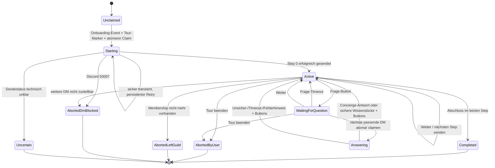

# Umsetzungskonzept: Mini-Server-Tour per DM

## Scope und Annahmen

Dieses Konzept ergänzt das native Onboarding um eine opt-in-basierte, interaktive DM-Tour. **Die bestehende Rang-Frage und ihre Brücke bleiben unverändert bestehen** (Owner-Entscheid 2026-07-15: nicht jeder will eine Tour, und beides zusammen auswählen ist ausdrücklich erlaubt). Es beschreibt nur diesen Zubau; andere Migrations- und Phasenpläne im Repository sind nicht Teil des Scopes.

Alle sichtbaren Texte bleiben bis zur finalen Redaktion ausdrücklich Platzhalter. Fest angenommen wird:

- genau eine zusätzliche optionale Onboarding-Frage (5. Prompt) mit genau einer Ja-Option;
- genau ein technischer Marker für die gesamte Tour, kein Themen-Multi-Select;
- sechs feste Schritte in der vom Owner vorgegebenen Reihenfolge;
- pro Schritt eine eigene DM-Nachricht, kein gebündelter Tour-Block;
- bestehender Concierge als einziger Antwortpfad für Freitextfragen;
- die alte Rang-Brücke (`onboarding_bridge_dm`) läuft parallel und unangetastet weiter; wählt ein User beide Fragen, bekommt er bewusst beide DM-Stränge (Rang-DM sofort, Tour-Schritte daneben).

## Ist-Zustand

### Rang-Onboarding-Brücke

`rust/crates/dl-community/src/onboarding_bridge.rs` behandelt heute genau einen Marker: die Rolle `Rang-Verknüpfung`. `decide_onboarding_bridge_actions()` ist die reine Entscheidungsfunktion; `OnboardingBridgePort` kapselt Member-Lookup, KV-Claim, Rang-Guide-Link, DM und Rollen-Cleanup. Dieses Muster bleibt verbindlich: neue Zustandsübergänge werden rein entschieden, Discord und PostgreSQL bleiben Port-Seiteneffekte.

`rust/bin/dl-bot/src/onboardingbridgeglue.rs` implementiert den Claim in `bot.kv_store` mit Namespace `onboarding_bridge_dm`, User-ID als Key und den Werten `claimed` beziehungsweise `dm_done`. `INSERT ... ON CONFLICT DO NOTHING` verhindert parallele Erstsendungen. Erfolg und Discord 50007 werden terminal behandelt; bei transientem Sendefehler wird der Claim heute freigegeben. Die Rang-Guide-Message-ID kommt über `serversync::rang_guide_message_id_key(0)` aus Namespace `serversync`; ohne Message-ID fällt der Link auf den Rang-Guide-Kanal zurück.

`onboardingbridgeglue.rs::spawn()` konsumiert `MemberEvent::NativeOnboardingCompleted`. Das Briefing beschreibt diesen Event als Level-Trigger. Der aktuelle Repository-Stand ist inzwischen strenger: `rust/crates/dl-discord/src/gateway.rs::completed_onboarding_from_member_update()` (Zeilen 93–102) emittiert nur beim Übergang `COMPLETED_ONBOARDING: false -> true`, abgesichert durch `completed_onboarding_flag_liefert_nur_echten_uebergang`. Der Tour-Claim bleibt trotzdem erforderlich: alte Deployments, doppelte/replayed Events und parallele Handler dürfen die Tour ebenfalls nicht doppelt starten.

### Native Onboarding-Prompts

`rust/bin/dl-bot/src/serversync.rs::build_welle2b_onboarding_config()` baut aktuell `weiche_prompt()`, `ping_prompt()`, den übernommenen 12er-Rang-Prompt und als vierte Frage `rang_verknuepfung_prompt()` (Zeilen 5960–6114). Die vierte Frage ist optional, `single_select: true` und ihre einzige Option signalisiert über eine `role_id`. `weiche_prompt()` dokumentiert die Discord-Validierung: Eine Option braucht mindestens eine `role_id` oder `channel_id`.

### Concierge

`rust/crates/dl-community/src/concierge.rs::handle_user_message()` (ab Zeile 3456) beantwortet bereits echte User-Fragen sowohl in DMs (`guild_id == None`) als auch im öffentlichen Supportkanal. Die eigentliche Faktenentscheidung liegt in `answer_with_knowledge_and_llm()` (ab Zeile 3944): zuerst lokale Konversationsantworten, dann der fail-closed Wissensdienst; nur bei `free_voice` folgt der konfigurierte `ChatProvider`. Ohne belegtes Wissen greift der vorhandene Wissenslücken-Pfad.

Der Concierge verarbeitet DMs aktuell in einem eigenen `Dispatcher::subscribe_messages()`-Subscriber (`concierge.rs::spawn()`, ab Zeile 6288). `Dispatcher` nutzt Broadcast; ein zweiter Tour-Subscriber kann Nachrichten nicht konsumieren. Ohne Routing-Änderung würden Tour und allgemeiner Concierge dieselbe DM parallel beantworten. Das muss vor der Tour-Anbindung behoben werden.

## Ziel-Design

### Ein Opt-in statt Themen-Multi-Select

`tour_opt_in_prompt()` kommt als **fünfte Frage zusätzlich** in `build_welle2b_onboarding_config()`; `rang_verknuepfung_prompt()` bleibt unverändert die vierte (Discord erlaubt bis zu 7 Prompts, wir gehen von 4 auf 5):

- `prompt_type: 0`
- `single_select: true`
- `required: false`
- `in_onboarding: true`
- eine Ja-Option mit genau einer Tour-Marker-`role_id`
- Titel: `PLATZHALTER: Frage, ob der User eine kleine Server-Tour möchte`
- Option: `PLATZHALTER: Ja-Option für die Server-Tour`
- Beschreibung: `PLATZHALTER: kurze Erklärung von Ablauf und Dauer`

Eine einzige Frage ist fachlich richtig, weil die Tour ohnehin alle sechs Kernthemen erklärt und jeder Schritt einzeln übersprungen beziehungsweise die Tour jederzeit beendet werden kann. Ein Themen-Multi-Select würde das Onboarding verlängern, zusätzliche Markerzustände erzeugen und User vorab Entscheidungen treffen lassen, deren Bedeutung sie erst in der Tour kennenlernen.

Es braucht eine neue technische Marker-Rolle für die Tour; die alte Rolle `Rang-Verknüpfung` (`1522762890174529546`) bleibt der Rang-Brücke vorbehalten. Beide Marker koexistieren dauerhaft und werden von getrennten Konsumenten verarbeitet. Rollenname und neue ID bleiben bis zur Anlage Platzhalter:

- Rollenname: `PLATZHALTER: technischer Name der Tour-Opt-in-Rolle`
- ID: `TOUR_OPT_IN_ROLE_ID`

Die Rolle hat keine Permissions, ist nicht hoisted und nicht mentionable. Sie ist ausschließlich ein kurzlebiges Signal und wird nach terminalem Startversuch entfernt.

### Feste Themenkonfiguration

Empfehlung für das MVP: eine feste `const TOUR_STEPS: [TourStep; 6]` in `rust/crates/dl-community/src/onboarding_bridge.rs`, keine neue TOML-Datei. Reihenfolge, Step-Keys und Link-Auflösung sind Protokollbestandteile und ändern sich nur mit Code und Tests. Eine TOML-Datei würde für sechs einmalig redigierte Texte einen Loader und zusätzliche Fehlerpfade schaffen. Erst wenn Copy ohne Binary-Deploy gepflegt werden soll, werden ausschließlich die sichtbaren Texte nach `assets/onboarding_tour_texts.toml` verschoben.

| Index | Step-Key | Inhalt und Ton | Link-Ziel |
|---:|---|---|---|
| 0 | `voice` | Router/Lanes; ausdrücklich freundlich und einladend, Ziel: User traut sich zu joinen | Router-Panel in `sprachkanal-verwalten`, Kanal `1513468476365209670` |
| 1 | `community_questions` | Fragen stellen; „trau dich, frag einfach“ | `frag-die-community`, `1426220702054355077` |
| 2 | `rank_link` | Steam verknüpfen und echten Rang erhalten | Rang-Guide-Link wie heutige Brücke: Channel-Konstante plus Message-ID aus `serversync`-KV |
| 3 | `patchnotes` | auf dem Laufenden bleiben | `PATCHNOTES_CHANNEL_ID`; im Repo wird der Kanal in `serversync.rs` aus dem Live-`GuildModel` per Name `patchnotes` aufgelöst, eine stabile Snowflake-Konstante ist nicht belegt |
| 4 | `support` | Hilfe bei Problemen | `support-ticket-eröffnen`, `1459628609705738539` |
| 5 | `streamers` | Community-Streamer; „schau vorbei, wenn dir langweilig ist“ | `deadlock-streamer`, `1304169815505637458` |

Jeder Step enthält nur interne Keys und sichtbare Platzhalter:

- `PLATZHALTER: kurze Erklärung für Step voice`
- `PLATZHALTER: kurze Erklärung für Step community_questions`
- `PLATZHALTER: kurze Erklärung für Step rank_link`
- `PLATZHALTER: kurze Erklärung für Step patchnotes`
- `PLATZHALTER: kurze Erklärung für Step support`
- `PLATZHALTER: kurze Erklärung für Step streamers`
- `PLATZHALTER: Link-Button je Step`
- `PLATZHALTER: Weiter-Button`
- `PLATZHALTER: Ich-habe-noch-eine-Frage-Button`
- `PLATZHALTER: Tour-beenden-Button`
- `PLATZHALTER: freundlicher Abschluss im letzten Step`

### Nachrichtenvertrag

Jeder Schritt erzeugt genau eine Step-Nachricht mit:

1. kurzer Erklärung für genau dieses Thema;
2. einem oder mehreren Link-Buttons zum Ziel;
3. `Weiter` und `Ich hab noch eine Frage`;
4. einer dezenten Möglichkeit, die Tour zu beenden.

Der letzte Schritt enthält statt `Weiter` den freundlichen Abschluss und eine terminale Abschlussaktion. Der Rank-Step darf nur den vorhandenen Rang-Guide verlinken; er implementiert keinen zweiten Steam-Flow. `Weiter` überspringt inhaltlich den aktuellen Schritt, ohne einen zusätzlichen „übersprungen“-Status zu benötigen.

Eine Concierge-Antwort ist keine zweite Step-Nachricht. Sie ist eine Antwortnachricht im Frage-Unterdialog und trägt erneut `Weiter`, `Ich hab noch eine Frage` und `Tour beenden`, damit mehrere Fragen zum selben Step möglich bleiben.

### Zustandsmaschine



`WaitingForQuestion` gilt nur bis `question_deadline_at`. Danach darf eine beliebige spätere DM nicht mehr als Tour-Frage abgefangen werden. Der Timeout setzt den Modus ohne Erinnerungs-DM auf `Active` zurück. Der vorhandene Frage-Button desselben Steps darf die Wartephase erneut öffnen; so entsteht keine zusätzliche Timeout-Nachricht. Empfehlung für das MVP: 24 Stunden, als eine Konstante statt neuer Laufzeitkonfiguration.

Die Frist wird fail-safe bei jedem State-Read ausgewertet; ein kleiner Recovery-Loop, der ohnehin persistierte Send-Retries abarbeitet, schreibt abgelaufene Wartezustände zusätzlich zurück. Antwortet der User nie, wird also keine Erinnerung gesendet und keine spätere DM dauerhaft von der Tour gekapert.

`Uncertain` ist bewusst terminal für automatische Sendewiederholungen: Wenn ein Discord-Timeout offenlässt, ob die Nachricht sichtbar wurde, ist automatisches Resenden ein Doppel-DM-Risiko. Ist die Nachricht sichtbar, funktionieren ihre Buttons nach Restart weiterhin und dürfen `Uncertain` für denselben Step in `Active` überführen. Ist sie nicht sichtbar, braucht es einen gezielten administrativen Repair; ein Repair-Command ist nicht Teil des MVP.

## Datenmodell und Persistenz

Empfehlung: neuer Namespace `onboarding_tour` in der vorhandenen `bot.kv_store`, User-ID als Key, versioniertes JSON als Value. Eine neue Tabelle wäre für genau einen kleinen Datensatz pro User unnötig; KV ist bereits das erprobte Claim-Muster der Brücke. Mehrschrittigkeit erfordert lediglich Row-Locking in kurzen Transaktionen (`SELECT ... FOR UPDATE`) statt ungeschütztem Read-Modify-Write.

Beispielstruktur, keine user-sichtbaren Texte:

```json
{
  "schema": 1,
  "status": "active",
  "step": "voice",
  "mode": "waiting_for_question",
  "dm_channel_id": "123",
  "last_tour_message_id": "456",
  "claimed_question_message_id": null,
  "question_deadline_at": "2026-07-16T12:00:00Z",
  "retry_count": 0,
  "next_retry_at": null,
  "updated_at": "2026-07-15T12:00:00Z"
}
```

`status` ist eines von `starting`, `active`, `completed`, `aborted_by_user`, `aborted_left_guild`, `aborted_dm_blocked`, `uncertain`. `mode` ist nur bei `active` relevant: `step`, `waiting_for_question` oder `answering`.

Der Erstclaim ist ein `INSERT ... ON CONFLICT DO NOTHING`. Alle Folgeübergänge sperren genau die User-Row, validieren Zustand und erwarteten Step, schreiben den Folgezustand und committen vor dem externen Aufruf. Für sendekritische Übergänge wird `starting` beziehungsweise ein internes Pending-Ziel gespeichert; nach eindeutigem Erfolg folgt `active`. Ein sicher transienter Fehler bleibt mit begrenztem Backoff persistent retrybar. Ein technisch unklarer Ausgang wird `uncertain` und nie blind erneut gesendet.

Nach erfolgreichem Versand von Step 0 oder bei 50007 wird die neue Tour-Marker-Rolle entfernt. Sie ist nur Startsignal, kein Fortschrittszustand; ab dann ist ausschließlich die KV-Row maßgeblich.

Die eingehende Frage wird vor dem Concierge-Aufruf atomar über `claimed_question_message_id` beansprucht. Replay derselben Discord-Message-ID oder parallele Subscriber erzeugen dadurch keine zweite Antwort.

### Custom-ID-Schema

```text
tour:v1:next:<step_key>
tour:v1:ask:<step_key>
tour:v1:end:<step_key>
tour:v1:finish:<step_key>
```

Die Interaction liefert die User-ID; sie gehört nicht in die `custom_id`. Der Handler vertraut weder Step noch Aktion allein, sondern vergleicht beides mit der persistenten User-Row unter Lock. Ein alter Button aus einem bereits verlassenen Step ist ein bestätigtes No-op; bei passendem Step kann ein Button nach Bot-Restart normal fortsetzen. Das Schema bleibt deutlich unter Discord-Limits und braucht keine signierten Payloaddaten, weil der User nur seinen eigenen KV-State verändern kann.

## Pure Decisions und Ports

Die bestehenden Dateien werden im MVP generalisiert, nicht durch zusätzliche Schichten dupliziert:

- `rust/crates/dl-community/src/onboarding_bridge.rs`: Tour-State, Step-Konfiguration, Inputs/Actions und reine Funktionen;
- `rust/bin/dl-bot/src/onboardingbridgeglue.rs`: PostgreSQL-, Discord-, Member- und Link-Port;
- `rust/bin/dl-bot/src/serversync.rs`: native Opt-in-Frage;
- `rust/crates/dl-community/src/concierge.rs`: wiederverwendbarer Tour-Frage-Einstieg und eindeutiges DM-Routing.

Kernfunktionen:

```text
decide_onboarding_tour_actions(input) -> Vec<TourAction>
decide_tour_component_actions(state, action, step) -> Vec<TourAction>
decide_tour_dm_message_actions(state, message_id, now) -> Vec<TourAction>
```

Die Funktionen entscheiden unter anderem `ClaimStart`, `SendStep`, `PersistState`, `OpenQuestionWindow`, `AnswerQuestionViaConcierge`, `ScheduleRetry`, `MarkUncertain`, `RemoveMarker`, `Complete` und `Abort`. Sie führen keine SQL-, Discord-, Zeit- oder Concierge-Aufrufe aus.

Der generalisierte Port stellt nur notwendige Seiteneffekte bereit:

```text
load_member_snapshot
claim_or_load_state
transition_state_locked
resolve_step_links
send_tour_message
member_still_in_guild
remove_marker_role
answer_question_via_concierge
```

Zeit (`now`) und Ergebnisse externer Aufrufe werden als Input in die pure Decision gegeben. Damit bleiben Fehler- und Retry-Entscheidungen wie in den heutigen `onboarding_bridge`-Tests tabellarisch prüfbar.

## DM-Message-Routing und Concierge-Anbindung

### Erkennung einer Tour-Frage

Eine eingehende `MessageEvent` gehört nur dann zur Tour, wenn alle Bedingungen erfüllt sind:

1. `guild_id == None` und der Autor ist kein Bot (bereits im Gateway gefiltert);
2. für `author_id` existiert `onboarding_tour` mit `status=active` und `mode=waiting_for_question`;
3. `channel_id` entspricht, sofern gespeichert, dem Tour-DM-Kanal;
4. `question_deadline_at > now`;
5. die Message-ID wurde noch nicht beansprucht.

Bei abgelaufenem Fenster setzt der Handler den Modus auf `step` zurück und gibt die DM an den allgemeinen Concierge weiter. So kapert ein vergessenes Tour-Fenster keine spätere private Nachricht.

### Eindeutiger Subscriber

Ein zusätzlicher unabhängiger Message-Subscriber ist falsch, weil `Dispatcher::subscribe_messages()` Broadcast-Semantik hat. Minimaler Refactor:

1. den Message-Loop aus `concierge.rs::spawn()` in einen expliziten Aufruf `handle_routed_message()` auslagern;
2. in `main.rs`/Glue genau einen Concierge-/Tour-DM-Loop registrieren;
3. Tour-Wartezustand zuerst prüfen und behandeln;
4. bei `NotTourMessage` unverändert `Concierge::handle_user_message()` aufrufen;
5. Member-, Voice- und Cadence-Tasks des Concierge bleiben in `concierge.rs::spawn()`.

Moderation, Statistiken und andere Broadcast-Leser bleiben unberührt. Entscheidend ist nur, dass es für automatische DM-Antworten genau einen Owner gibt.

### Wiederverwendbarer Concierge-Einstieg

`answer_with_knowledge_and_llm()` ist fachlich der richtige Kern, aber privat und nicht allein ausreichend: Datenschutz-Lock, Verlauf, Zustellung, Unsicherheitsbehandlung und Opt-out liegen im umgebenden `handle_user_message_inner()`-Pfad. Die Tour darf die private Funktion daher nicht direkt aufrufen und kein neues Ask-Backend bauen.

Empfohlener kleiner Refactor in `concierge.rs`:

```text
answer_tour_dm_question(channel_id, user_id, question, response_components)
    -> ConciergeAnswerOutcome
```

Die Methode verwendet denselben User-Lock, `begin_privacy_action()`, Conversation-/History-Pfad, `answer_with_knowledge_and_llm()`, Delivery-Transaktion und `send_answer_uncertain_notice()` wie normale DMs. Der einzige Zusatz sind die vom Tour-Builder gelieferten Buttons an normaler Antwort, Wissenslücke und Unsicherhinweis. `ConciergeAnswerOutcome` enthält keine Antworttexte, sondern nur `Answered`, `NoAnswer`, `PrivacyStateless`, `Uncertain`, `Timeout` oder `Error`, damit der Tour-State und strukturierte Logs vollständig aktualisiert werden können.

Weitere Fragen bleiben möglich: Nach jedem Outcome außer terminalem Membership-/DM-Fehler wechselt die Tour von `answering` zurück zu `active` im selben Step; die Antwort trägt wieder Frage- und Weiter-Buttons.

### Keine Antwort, Timeout und Fehler

- Kein Knowledge-Hit: vorhandenen sicheren Wissenslücken-Pfad verwenden; kein erfundener Tour-Fallback.
- LLM nicht verfügbar: vorhandenes `knowledge.or_else(KNOWLEDGE_GAP_TEXT)` verwenden.
- Discord-Zustellung fehlgeschlagen oder Commit unklar: vorhandenes Muster `send_answer_uncertain_notice()` (ab `concierge.rs:4095`) verwenden und Outcome `Uncertain` loggen.
- Knowledge- oder Provider-Timeout: Outcome `Timeout`, vorhandener sicherer Textpfad, danach Tour-Buttons.
- interner Fehler: Outcome `Error`, keine Sachantwort vortäuschen, vorhandenen Fehler-/Unsicherpfad verwenden.

Alle sichtbaren Texte dieser Pfade bleiben `PLATZHALTER: Concierge-Tour-Hinweis für <Outcome>`, soweit nicht unverändert ein bestehender Concierge-Text wiederverwendet wird.

## Datenschutz und LLM-Compliance

Die Tour führt keinen neuen LLM-Anbieter und keinen neuen Datenklassentyp ein. Reale Freitext-DMs werden bereits heute von `Concierge::handle_user_message()` verarbeitet. `main.rs` baut dafür `LlmProviderConfig` mit `LlmUseCase::BotPate` (Zeilen 821–844). Der Default in `rust/crates/dl-ai/src/chat_provider.rs::default_provider_for()` ist für `BotPate` **Fireworks**; `DL_LLM_PROVIDER_BOT_PATE` beziehungsweise der globale Override kann das ändern. Alle Use-Cases sind `LlmDataClass::UserContent`. MiniMax ist für User-Content durch `enforce_compliance()` blockiert, außer dem ausdrücklich benannten Dev-Escape-Hatch.

Damit ist die Tour bei Wiederverwendung dieses exakten Concierge-Pfads kein neuer Datenfluss und §5.6 kein neuer MVP-Blocker. Rollout-Gate bleibt: effektiven Provider/Use-Case ohne Secretwerte prüfen; kein separater Tour-Provider, kein anderer Endpoint und kein zusätzliches Tour-Transcript an den Provider. Falls die Implementierung hiervon abweicht, ist §5.6 vor Aktivierung ein Blocker.

Der globale Datenschutz-Opt-out wird exakt wie heute respektiert:

- `core.user_privacy.opted_out` wird unter Privacy-Lock geprüft;
- keine Conversation-Persistenz und kein History-Kontext bei Opt-out;
- direkte DM darf über den vorhandenen stateless Pfad beantwortet werden;
- kein Tour-Code schreibt den Fragetext zusätzlich in KV oder Logs;
- `stopp` und `vergiss mich` behalten die vorhandene Concierge-Semantik und werden nicht als Sachfrage behandelt.

`FAQ_PRIVACY_BLOCK_TEXT` in `faq.rs` ist das Vorbild: Opt-out verhindert einen neuen verlaufsspeichernden FAQ-Chat, erlaubt aber direkte, stateless beantwortete DMs. Die Tour darf den Opt-out nicht durch einen eigenen Verlauf umgehen.

`log_answer_decision()` wird um `route="onboarding_tour"` und ein vollständiges Outcome-Feld erweitert. Für jede Tour-Frage wird genau ein terminales Urteil `answered`, `no_answer`, `privacy_stateless`, `uncertain`, `timeout` oder `error` geloggt, zusätzlich `knowledge_hit`, Step-Key, User-ID und Message-ID. „Voll loggen“ bedeutet vollständige Entscheidungsabdeckung, nicht Klartextkopien: Fragetext und Antworttext gehören nicht in Logs; beim Opt-out insbesondere keine Fragevorschau. Bestehende DB-Persistenz des normalen Concierge bleibt unverändert.

## Fehlerfälle

### Discord 50007

Beim Start: `aborted_dm_blocked` persistieren, Marker entfernen, Info-Log, kein Retry. Während der Tour: denselben terminalen Zustand setzen; spätere DMs dürfen nicht mehr als Tour-Fragen geroutet werden. Eine öffentliche Ersatznachricht wird nicht gesendet, weil das Opt-in ausdrücklich eine private Tour betrifft.

### Transiente und unklare Fehler

Eindeutig transiente Fehler erhalten einen kleinen persistenten Backoff mit begrenzter Versuchszahl. Retry wird aus `next_retry_at` nach Restart wieder aufgenommen; er hängt nicht von einem zweiten Onboarding-Event ab. Nach Ausschöpfen der Versuche: `uncertain` beziehungsweise terminaler Fehlerzustand, Warnlog, kein Endlosloop.

Bei unklarem HTTP-/Commit-Ausgang wird nie automatisch dieselbe Nachricht erneut gesendet. Das folgt der vorhandenen Concierge-Strategie, sichtbare möglicherweise zugestellte Antworten nicht destruktiv zu behandeln.

### User verlässt den Server

Vor dem nächsten Step und vor einer Tour-Frage prüft der Port die Membership. Fehlt sie, wird `aborted_left_guild` persistiert und die Nachricht nicht mehr als Tour-Frage verarbeitet. Rollen-Cleanup darf 404/fehlende Membership als abgeschlossen behandeln. Kein Poller ist nötig; geprüft wird nur bei der nächsten Aktivität.

### Restart und Doppelstart

Der atomare Erstclaim verhindert mehrere Starts. Buttons rekonstruieren keinen Zustand aus der `custom_id`, sondern laden die KV-Row; dadurch überleben sie Restarts. `starting`, Retry-Daten, aktueller Step und Fragefenster sind persistent. Gleichzeitige Klicks werden durch Row-Lock und erwarteten Step serialisiert. Alte Buttons werden No-op statt einen Step doppelt zu senden.

## Koexistenz mit der alten Brücke

Es gibt keine Migration: Die Rang-Brücke (Frage 4, Rolle `1522762890174529546`, Namespace `onboarding_bridge_dm`) bleibt vollständig unangetastet und läuft parallel weiter (Owner-Entscheid 2026-07-15). Die Tour bekommt eine eigene neue Marker-Rolle und den eigenen Namespace `onboarding_tour`; beide Konsumenten reagieren auf dasselbe `NativeOnboardingCompleted`-Event, prüfen aber nur ihren jeweiligen Marker. Wählt ein User beide Fragen, laufen beide Stränge unabhängig: Rang-DM sofort, Tour-Schritte daneben — die inhaltliche Überschneidung (Rang-Thema kommt in der Tour als Step 2 nochmal vor) ist bewusst akzeptiert, weil User, die nur die Tour wählen, das Thema sonst nie sähen.

Da der Onboarding-Abschluss ein Edge-Trigger ist (`completed_onboarding_from_member_update`), können Bestandsmitglieder die Tour nicht nachträglich auslösen — es gibt keinen Altbestand zu unterdrücken.

## Onboarding-Änderung über serversync

In `build_welle2b_onboarding_config()` kommt `tour_opt_in_prompt(tour_opt_in_role)` als fünfte Frage hinzu; `rang_verknuepfung_prompt()` bleibt unverändert die vierte. Die ersten drei Prompts, der übernommene 12er-Rang-Prompt, Defaults und Sanitizing bleiben unverändert. `tour_opt_in_prompt()` löst die neue Rolle über das vorhandene `GuildModel`; fehlt sie, blockiert der Build. Die Ja-Option enthält genau die `role_id`, damit die Discord-Anforderung erfüllt ist.

Ausbringung nutzt den vorhandenen Preview-/Hash-gated `onboarding_apply()`-Pfad. Bekannte kosmetische Einschränkung: Preview erreicht derzeit auch bei inhaltlich gleichem Soll nicht zuverlässig einen No-op. Daher nicht auf „keine Änderungen“ warten, sondern Diff und Hash prüfen, einmal applyen und den Live-Zustand anschließend per API beweisen.

## Test-Plan (TDD)

### 1. Pure Decision-Tabellen

Zuerst rote Tests neben den heutigen `onboarding_bridge.rs`-Tests:

- falsche Guild, Bot, kein Marker: keine Aktion;
- Erstclaim, bereits `starting`, `active`, terminal: exakt erwartete Aktionen;
- nur Rang-Marker ohne Tour-Marker: keine Tour-Aktion (Koexistenz-Beweis);
- Step-Reihenfolge 0–5, Weiter, Abschluss, User-Abbruch;
- Ask -> Waiting -> Question-Claim -> Answer -> gleicher Step;
- mehrere Fragen im selben Step;
- abgelaufenes Fragefenster routet nicht zur Tour;
- 50007, sicher transient, Retry-Limit, unklarer Ausgang;
- Membership verloren;
- doppelter Button und doppelte Message-ID sind No-op.

### 2. Port- und Persistenztests

- konkurrierender `INSERT ... ON CONFLICT`: genau ein Gewinner;
- `SELECT ... FOR UPDATE` serialisiert zwei Weiter-Klicks;
- JSON v1 round-trip und unbekannte Schema-Version fail-closed;
- Restart lädt `active`, `waiting_for_question`, `starting/retry` korrekt;
- Tour-Claim liest/schreibt nie im Namespace `onboarding_bridge_dm` (Koexistenz);
- Marker-Cleanup bei Erfolg und 50007;
- Rang-Guide-Message-ID und Kanal-Fallback wie heute;
- Patchnotes-Link verwendet aufgelöste Live-ID beziehungsweise den expliziten Platzhalter bis zur belegten ID.

### 3. DM-Routing und Concierge

- DM ohne Tour-Wartezustand geht einmal an den normalen Concierge;
- passende DM geht einmal an `answer_tour_dm_question()`, nicht zusätzlich an den allgemeinen Pfad;
- Public/Guild-Message wird nie Tour-Frage;
- abgelaufener Wait-State fällt zum allgemeinen Concierge durch;
- `stopp`/`vergiss mich` behalten Kontrollsemantik;
- Opt-out: keine Conversation-Persistenz, kein History-Kontext, stateless Antwort;
- Knowledge-Hit, No-Answer, Providerfehler, Timeout und `send_answer_uncertain_notice()`;
- jedes Urteil erzeugt genau ein strukturiertes Outcome-Log ohne Klartextfrage;
- Antwort enthält erneut Weiter/Frage/Ende und erlaubt eine zweite Frage.

### 4. Components und serversync

- Custom-IDs für alle Steps/Aktionen; stale Step ist No-op;
- jeder Step erzeugt genau eine Step-Nachricht und nur seine Links;
- letzter Step hat Abschluss statt Weiter;
- jetzt genau fünf native Prompts;
- Prompt 4 (Rang) byte-identisch unverändert;
- Prompt 5: optional, single-select, genau eine Option, genau eine neue Marker-Role-ID;
- fehlende Tour-Rolle blockiert Preview/Apply-Build.

Nach Green: `cargo fmt --check`, gezielte Tests für `dl-community`, `dl-bot`/serversync und `dl-discord`, danach relevante Clippy-Läufe mit `-D warnings`. Kein Live-Apply in Tests.

## Rollout

1. **Rolle:** neue permissionlose Tour-Marker-Rolle anlegen; ID und Attribute per Guild-GET prüfen.
2. **Deploy:** Tour-Konsument mit neuem KV-Namespace deployen (alte Brücke unangetastet); Concierge-Routing und effektiven `BotPate`-Provider ohne Secretwerte prüfen.
3. **Onboarding-Apply:** Preview-Inhalt und Hash prüfen, `serversync onboarding-apply` einmal bestätigt ausführen. Der bekannte kosmetische Preview-No-op ist kein Blocker.
4. **Live-Beweis:** `GET /guilds/{id}/onboarding` zeigt fünf Prompts; Prompt 4 (Rang) unverändert, Prompt 5 optional/single-select mit genau einer Ja-Option und der neuen Role-ID.
5. **Echter Durchlauf:** frischer Testuser optiert ein; genau eine DM je Step, Frageunterdialog über Concierge, Restart zwischen zwei Steps, Ende/Abbruch, Marker entfernt und KV terminal.
6. **Negativbeweise:** Testuser mit blockierten DMs -> 50007/terminal; Testuser, der beide Fragen wählt -> Rang-DM und Tour laufen beide, unabhängig und je genau einmal.

Rollback: vorherige Onboarding-Konfiguration erneut anwenden und alte Binary starten. Der neue Namespace beeinflusst den alten Worker nicht; alte Tombstones bleiben erhalten. Die neue Marker-Rolle bleibt bis zur Klärung liegen und hat keine Permissions.

## Aufwand in Wellen

| Welle | Inhalt | Schätzung |
|---|---|---:|
| 1 – Zustandskern | Pure Decisions, JSON-State, KV-Claim/Locks, Components, sechs Steps | 1,5–2 Tage |
| 2 – Concierge/Routing | einzelner DM-Owner, wiederverwendbarer Concierge-Einstieg, Privacy-/Outcome-Logs | 1–1,5 Tage |
| 3 – Native Onboarding | neue Rolle, `tour_opt_in_prompt()` als 5. Frage, serversync-Tests | 0,5–1 Tag |
| 4 – Verifikation/Rollout | Restart-, 50007-, Opt-out- und echter End-to-End-Durchlauf | 0,5–1 Tag |

MVP: Wellen 1–4, insgesamt etwa 3,5–5,5 Entwicklertage inklusive Tests und Live-Beweis. Später, nur bei echtem Bedarf: Copy aus TOML laden, Admin-Repair/Restart, Reminder, Tour-Analytics oder manuelle Wiederholung für Altuser. Diese Punkte sind nicht Voraussetzung für die erste sichere Tour.

## Offene Fragen an den Owner

1. **Fragefenster:** Sind 24 Stunden ohne Antwort passend? Empfehlung: ja; danach fällt eine spätere DM wieder an den normalen Concierge.
2. **Logging-Auslegung:** Darf „voll loggen“ als vollständige Outcome-Metadaten ohne Frage-/Antwortklartext umgesetzt werden? Empfehlung: ja; Inhalte bleiben ausschließlich im bereits datenschutzgesteuerten Concierge-Speicher.

Entschieden (Owner 2026-07-15): Die Rang-Frage bleibt als eigenständige 4. Frage bestehen; die Tour ist eine zusätzliche 5. Frage, beides ist kombinierbar. Keine Migration, keine Legacy-Suppression.

## Nachtrag 2026-07-15 (Aktivierung): Discord-Limit erzwingt kombinierte Frage

Discord erlaubt hart maximal 4 Onboarding-Fragen (PUT-Fehler
`TOO_MANY_ONBOARDING_PROMPTS`, live verifiziert). Die geplante 5. Frage ist damit
unmöglich. Umsetzung stattdessen: Rang-Opt-in und Tour-Opt-in teilen sich die
4. Frage „Willst du Starthilfe?" als Multi-Select mit zwei unabhängigen Optionen
(🔗 Rang / 🧭 Tour, `starthilfe_prompt()` in serversync.rs). Beide Marker-Rollen,
beide Folge-Flows und die Kombinierbarkeit bleiben unverändert; nur die
Fragen-Hülle ist geteilt. Außerdem beim Apply gefunden: Die Default-Kanal-Liste
musste an den Live-Server angepasst werden (memes/deadlock-invite im Archiv →
off-topic/gameplay-clips), sonst blockt die Discord-Regel „mind. 5 Defaults mit
@everyone VIEW+SEND".
