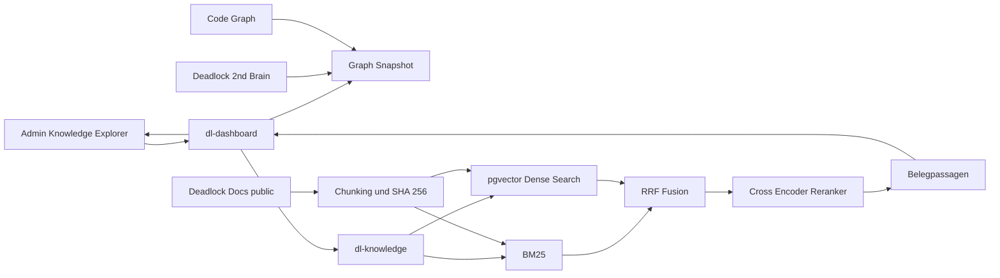

# Zweitgehirn als Knowledge Workspace

Stand: 20.09.2026

## Ziel

Das Admin Zweitgehirn wird von einer technischen Knotenübersicht zu einer wissenszentrierten Arbeitsfläche. Wissen, Retrieval und technische Belege bleiben fachlich getrennt, können aber in derselben Oberfläche untersucht werden.

Die bestehende Rust Architektur bleibt die Produktionsbasis. Das vermeidet einen zweiten API Stack und nutzt den bereits vorhandenen Hybrid Retrieval Pfad mit BM25, pgvector, lokalem Embedding und lokalem Cross Encoder.

## Architekturentscheidung

### Frontend

Für die aktuelle Migration bleibt die vorhandene Admin SPA bestehen. Der Visual Brain Renderer wird als austauschbarer Adapter behandelt.

Kurzfristig:

* Vollflächen Canvas statt Kartenraster
* Wissensansicht als Standard
* Technik und Code in einer getrennten Belegebene
* Force Layout für kleine und mittlere Ausschnitte
* Detail Drawer
* Hybrid Retrieval aus derselben Suchoberfläche

Mittelfristig:

* Sigma.js plus Graphology für sehr große Wissensgraphen
* vis-network nur als Kompatibilitätsrenderer während der Migration
* React Flow beziehungsweise xyflow ausschließlich für kuratierte, manuell angeordnete Arbeitsflächen, nicht für den globalen Wissensgraphen
* tldraw für freie Whiteboard Inhalte, falls Nutzer später eigene Denkflächen anlegen sollen
* Cytoscape.js für Analyseansichten, falls Graphalgorithmen im Browser wichtiger werden als maximale WebGL Skalierung

### Backend

Der bestehende Dienst `dl-knowledge` ist der Retrieval Kern.



Die Admin API proxyt Retrieval nur auf Loopback. Antworten des Retrieval Dienstes werden erneut validiert. Interne Pfade werden dabei nicht als öffentliche Belege akzeptiert.

## Ebenenmodell

### Wissensebene

Wissensknoten sind Dokumente, Guides, FAQs, Patchinformationen und kuratierte Spielinformationen.

Ein Wissensknoten besitzt mindestens:

```text
KnowledgeNode
id
title
source_path
source_type
visibility
topic
valid_from
valid_to
game_version
content_hash
updated_at
```

### Belegebene

Die Belegebene enthält technische Implementierungsbezüge und Systemknoten. Sie ist für Diagnose und Nachvollziehbarkeit gedacht und wird in der normalen Wissensansicht ausgeblendet.

```text
EvidenceNode
id
label
repository
source_path
source_location
kind
updated_at
```

### Kanten

```text
KnowledgeEdge
source_id
target_id
relation
confidence
evidence_ids[]
valid_from
valid_to
created_at
```

Mögliche Relationen:

* related_to für kuratierte semantische Beziehungen
* changed_by für Patchbezüge
* applies_to für Held, Item oder Mechanik
* answers für FAQ Beziehungen
* cites für explizite Quellen
* shared_evidence für abgeleitete Beziehungen über denselben technischen Beleg
* documents für Dokument zu Code Belege

`shared_evidence` ist abgeleitet und muss in der UI als solche kenntlich bleiben.

## Chunk Modell

Der bestehende Dense Index verwendet bereits Inhalts Hashes. Das Zielmodell bleibt:

```text
KnowledgeChunk
chunk_id
document_id
content_hash
chunk_text
title
section
source_type
source_path
language
game_version
valid_from
valid_to
observed_at
embedding_model_fingerprint
index_generation
```

Ein Chunk wird anhand seines kanonischen Embedding Textes mit SHA 256 gehasht. Ist der Hash in einer kompatiblen Modellgeneration vorhanden, wird das Embedding wiederverwendet.

## Hybrid Retrieval

Die Produktionsreihenfolge ist:

1. Query normalisieren.
2. Exakte FAQ Treffer zuerst prüfen.
3. BM25 Kandidaten für Eigennamen, IDs, Befehle und Fehlercodes erzeugen.
4. Dense Kandidaten aus pgvector erzeugen.
5. Metadatenfilter vor der endgültigen Kandidatenmenge anwenden.
6. BM25 und Dense mit gewichteter Reciprocal Rank Fusion zusammenführen.
7. Kandidaten mit lokalem Cross Encoder neu sortieren.
8. Belegpassagen validieren.
9. Bei fehlender Evidenz `no_evidence` zurückgeben.
10. Antworten ausschließlich aus ausgewählten Belegpassagen erzeugen oder anzeigen.

Für die aktuelle Infrastruktur ist Postgres plus pgvector passender als ein zusätzlicher Qdrant oder Weaviate Dienst. Ein separater Vektorserver wird erst relevant, wenn Indexgröße, Schreiblast oder horizontale Skalierung die Postgres Grenze praktisch erreichen.

## Grounding Vertrag

Ein Antwortpfad darf nur Belege aus freigegebenen Quellen verwenden.

Erforderliche Felder pro Beleg:

```json
{
  "id": "C1",
  "source": {
    "kind": "community_page",
    "title": "Titel",
    "path": "discord/beispiel.html"
  },
  "text": "Belegpassage",
  "observed_at": "2026-09-20"
}
```

Fehlt belastbare Evidenz, ist der fachliche Endzustand `Nicht gefunden`. Das Modell erhält keine Berechtigung, fehlende Fakten aus Vorwissen zu ergänzen.

## Integrationspfad A

Ein Greenfield Frontend könnte Next.js mit App Router, Tailwind und shadcn/ui einsetzen. Für dieses Projekt ist ein sofortiger Next.js plus FastAPI Umbau nicht sinnvoll, weil Auth, Admin Routing, Retrieval und Betriebslogik bereits in Rust existieren.

Soll die Admin Oberfläche später vollständig auf React wechseln, lautet der Zielpfad:

```text
Next.js UI
  -> bestehende Rust Admin API
  -> dl-knowledge
  -> Postgres plus pgvector
```

FastAPI wird dabei nicht benötigt.

## Integrationspfad B

Obsidian kann als Curation Oberfläche für kuratierte Wissensdokumente dienen.

Empfohlener Fluss:

```text
Obsidian Vault
  -> Git oder kontrollierter Sync
  -> Validierung
  -> öffentliche und interne Senke trennen
  -> Chunking
  -> SHA 256 Diff
  -> Embedding Aktualisierung
  -> Index Generation
  -> atomare Aktivierung
```

Der lokale Vault ist nicht direkt der Produktionsindex. Erst validierte Inhalte werden in einen freigegebenen Snapshot übernommen.

## Umsetzung im aktuellen Stand

Die erste Ausbaustufe umfasst:

* Knowledge Explorer als Vollflächen Canvas
* Wissen als Standardansicht
* separate Technik und Belege Ansicht
* Detail Drawer
* Themencluster
* Force Layout für überschaubare Ausschnitte
* Hybrid Retrieval direkt aus der Explorer Suche
* erneute Validierung der Retrieval Antwort im Admin Backend
* expliziter Zustand für fehlende Evidenz
* API Felder `layer` und `visibility` zur Trennung der Ebenen

## Migrationsplan

### Phase 1

Bestehende Graphdaten weiterverwenden, Wissensoberfläche vor die technische Sicht setzen und Hybrid Retrieval integrieren.

### Phase 2

Wissenskanten fachlich erweitern. Held, Item, Patch, Build, FAQ und Mechanik werden als eigene Knotentypen materialisiert. Codebezüge bleiben Belege.

### Phase 3

Graph Snapshot aus dem Datei Export in eine versionierte Graph Projektion überführen. Die Projektion wird aus Dokumentmetadaten, Retrieval Metadaten und kuratierten Relationen erzeugt.

### Phase 4

Renderer auf Sigma.js plus Graphology umstellen, sobald reale Ausschnitte die vis-network Grenze erreichen. Die UI API bleibt dabei unverändert.

### Phase 5

Optionalen Obsidian Curation Pfad anbinden. Jeder Import durchläuft Validierung, Hash Diff und atomare Index Aktivierung.

### Phase 6

Wenn die Admin Oberfläche insgesamt auf React umgestellt wird, Knowledge Explorer als eigene Route mit Tailwind und shadcn/ui neu aufsetzen. Das Rust Backend und `dl-knowledge` bleiben bestehen.

## Abnahmekriterien

* Die Standardansicht zeigt Wissen statt Infrastruktur.
* Codeknoten sind erst nach Wechsel in die Technikansicht sichtbar.
* Suche liefert sowohl lokale Graph Treffer als auch Hybrid Retrieval Belege.
* Fehlende Evidenz wird als nicht gefunden dargestellt.
* Interne Quellen können nicht über den Retrieval Proxy als öffentliche Belege ausgegeben werden.
* Graph und Retrieval bleiben ohne JavaScript Generierung serverseitig zugriffsgeschützt.
* Bestehende Admin Auth bleibt unverändert.
